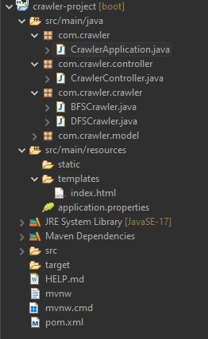
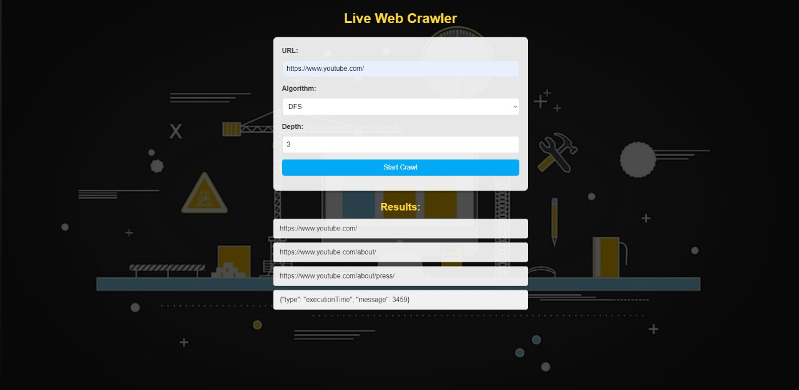

# Web Crawler Project  

## Introduction  
This project implements a web crawler using BFS (Breadth-First Search) and DFS (Depth-First Search) algorithms. The user inputs a search topic and selects the crawling algorithm. The crawler extracts links recursively from web pages and displays execution time and results.  

## Features  
- Web crawling using BFS and DFS.  
- User input for search topic and algorithm selection.  
- Recursive link extraction with a depth limit.  
- Execution time calculation for performance comparison.  
- Web-based interface for user interaction.  
- Deployed using Spring Boot and Gradle.  

## Technologies Used  
- **Java** (Spring Boot, Jsoup for web scraping)  
- **Gradle** (for project management)  
- **HTML, CSS, JavaScript** (for UI development)  
- **IntelliJ & VS Code** (for development)  

## Installation & Setup  
1. Clone the repository:  
   ```sh  
   git clone https://github.com/your-repo/web-crawler.git  
   ```  
2. Navigate to the project directory:  
   ```sh  
   cd web-crawler  
   ```  
3. Build the project using Gradle:  
   ```sh  
   ./gradlew build  
   ```  
4. Run the application:  
   ```sh  
   java -jar build/libs/web-crawler.jar  
   ```  
5. Access the web interface at:  
   ```sh  
   http://localhost:8080  
   ```  

## Usage  
1. Open the web application in your browser.  
2. Enter a search topic and select BFS or DFS.  
3. Click "Start Crawling" to begin the process.  
4. View extracted links and execution time in the results.  

## Results  
Below are some screenshots showcasing the results of the web crawler:  

  
  

## Project Poster  
Here is a poster summarizing the project:  

  

## Contributors  
- **Garav Aggarwal** - Developer  
- **Hitesh Matharu** - Developer

## License  
This project is licensed under the MIT License - see the [LICENSE](LICENSE) file for details.  

## Contact  
For any queries, contact **garav.work23@gmail.com**  
